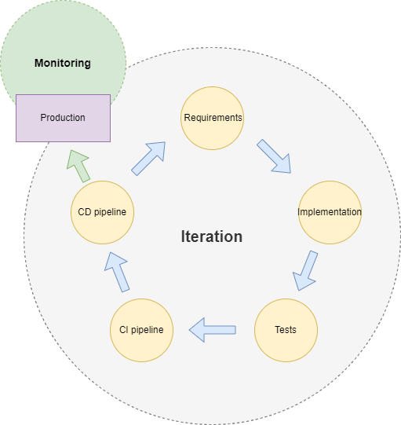

# The Minimal Software Development Process

The mimimal amount of steps to turn ideas into working software are the following

1. Understand the problem
2. Solve the problem
3. Confirm the problem is solved
4. Make the solution available to users
5. Keep on eye that the solution keeps working

More commonly, these steps are written in the following format

1. Write requirements
2. Implement the solution
3. Test the solution
4. Deploy the solution into production
5. Monitor the application (availability, performance, ...)

If we release code AS IS and don't provide any support for it, only the first two steps are required. But when someone is paying us to implement and maintain software, all the five steps are required.

## Working in Small Steps

At the start, no one really knows what the end users want. Even the end user themselves may not know what they want. Therefore, changes are inevitable and we must have an ability to change our minds and our software with ease. To enable this:
- We need to able to easily spot the needs for change
- We need to able to make these changes easily, safely and with confidence

To easily spot the need for this kind of change, **we need to make progress in very small steps**. If the step is too big, then we won't spot the mistake until we have already done a lot of work. Also fixing the mistake at this point will be more laborous.

From the viewpoint of software architecture, **our software needs to be modular** for us to easily change individual modules without affecting the rest of the system. This can achieved by following good design and coding practices like [SOLID](https://en.wikipedia.org/wiki/SOLID).

From the viewpoint of writing code, we need robust versioning control system, like [git](https://git-scm.com/), which makes it easier to handle concurrent work done by multiple developers with a possiblity to travel back in time when we need to.

## User Stories

User stories need to express **what the users want** and **not how the solution should look like**. Otherwise the requirements will be too tightly coupled with the solution and any change to the solution also invalidates the requirement. If, along the way, we need radical changes to the solution, we must be able to do so, without the need to modify the original user story.

However, if the original story needs a change, then it is natural that also the solution is updated accordingly.

### Acceptance Criteria

User stories must have acceptance criteria that specifies when the story is complete. They are written in a **specific, measurable, and testable format**, and outline the specific requirements and functionality that the user expects from the system. Acceptance criteria should be well-defined and unambiguous, to ensure that everyone involved in the development process has a clear understanding of what needs to be delivered.

## Implementation and Testing

As already mentioned, we prefer making the implementation in small batches to detect mistakes sooner. This requires fast feedback, but what kind of feedback? There are actually a lot of different kinds of questions that require an answer, some written down below.

- Does it solve the problem?
- Does it meet the acceptance criteria?
- Is it adequately tested?
- Does the unit tests pass?
- Does our code work with changes made by others?
- Is it deployable?

Some of these questions cannot be answered by a computer. For example, only humans can probide an answer to the questions such as 'Does it solve the problem?' or 'Is it adequately tested?'. A computer can, however, answer to 'Does the unit tests pass?'. All these questions need a definite 'yes' before the whole implementation can be regarded as Done, but we need to understand which of questions we can automated and which have to be resolved by us, humans. 

Some of the questions can be answered while writing code. For example, for simple code changes, only a few unit tests can be adequate verification. Notice that this is a decision made by the developer. After this decsion automated test can easily verity that the tests passes. In this perspective, everyone has responsibility of the quality of our software.

Since testing is crucial, it is beneficial to practice Test-Driven Development and write unit tests first. This forces your actual solution to be more modular for it to be more easily testable.

For the question of deployability, we might not be able answer at this point, because when working locally we don't know the state of our shared code base. Even if our change is working, someone else might have published code that makes our tests fail, which means that when our change is published, it belongs to a version that is not in deployable state.

## Continuous Integration

As mentioned in the previous chapter, we need to know if our code change is working with changes made by others. In order to answer this, we first have to share our code with others. One common problem with code sharing is code conflict caused by concurrent changes to the same file. To most fool-proof way to detect this is to synchronize the code with others more frequently, ideally multiple times per day. This does not remove the problem completely, but reveals it sooner and therefore may help to prevent solutions that are not going to work.

We still haven't answered to our question: Does our code work with changes made by others? We can achieve this by creating a CI pipeline that is executed each time a commit is made. The pipeline can verify that the software builds and all the unit tests pass. **The outcome of this pipeline is the definite answer to our question**.

 

This gives us good confidence that the tests executed later will pass too. The later tests should pass at least 80 % of the time when all the unit tests pass. If they fail more often than this, then we lose the confidence of our fast feedback and unit test coverage must be increased to keep up the confidence level.

Because the build pipeline is executed repeatedly, it should ideally take less than 5 minutes.

> Warning! Sharing parts of the implementation needs special attention in perspective of security since every commit is a potential production version. Partly implemented functionality must not weaken our quality. There are several techniques to handle this, where the main idea is to prevent users from using unfinished (unpublished) functionality.

## Continuous Deployment

When CI pipeline passes, the continuous deployment pipeline is triggered automatically. This pipeline verifies that the code is deployable into production. Any means can be used to verify this, for example

- running acceptance tests
- installing solution to test environment for manual testing
- running other tests and reports (performance tests, security tests, legislative compliance test, etc...)

Ideally, all of the steps here are automated.

The result of the acceptance pipeline is treated as the definite answer to the question of deployability. **If all the tests pass, the software is, by definition, deployable to production**. Sometimes, however, the deployment is delayed for business reasons. We may want to wait until one or more features are completely done.

### Deployment

Installation to production can happen automatically, or it must be very easily scheduled, or triggered manually.

Even the generation of release notes can be automated, because every deployment has a scope of features that are released. These features are our user stories that can be converted into release notes by automation tools.

## Monitoring

It is crucial that the software deployed is usable at all times, unless otherwise defined. If the software is not available, all the previous efforts put in would be rendered useless. In order to ensure that production problems are promptly addressed, it is important to have a system in place that alerts us when issues arise. This necessitates automated monitoring and, even more importantly, an automated warning system that notifies us when problems occur. This way, we don't have to spend time looking at statistics with our own eyes, but can still react quickly to issues and minimize any potential disruptions to the system.

Notice that some monitoring solutions can be implemented using Infrastructure as Code, which means that monitoring process can be included in the development phase of the solution.

# The Process in Practice

The mimimal software development process can be illustrated in the following way. The iteration in the picture means one simple code change, that implements one part of a bigger story.

1. Everything starts with requirements.
2. Implementation is made meeting the requirements and their acceptance criteria.
3. Automation tests are written to proof that the implementation actually works as acceptance criteria dictates.
   - Notice that some tests can be written before the actual code, if Test-Driven Development process is being followed!
4. Code commit triggers the CI pipeline.
   - This is where all the fast unit tests are executed.
5. After successful CI pipeline, CD pipeline is automatically triggered.
   - This executes all the other tests remaining tests that are usually more slowly to execute.
6. After all the tests pass, the software can be automatically deployed to production if Continuous Deployment is being applied.

This is the fundamental idea behind agile software development. In Scrum, the iteration (or sprint) is usually two weeks long. So as long as you are able to deploy at the end of the sprint, you are basically following Scrum. This doesn't mean that the iteration have to be that long. The smallest iteration length could be the time that takes you to fix one line of code with with a unit test to verify the fix. Then add the time of your CI/CD pipeline to the total time and it might be even under an hour! Now that's agile! This is the minimal software process development in a nutshell.

## Prefer pair programming over pull requests

Code reviews are an important part of quality assurance, but it does not mean using pull requests is the only way to practice it. Code reviews using pull requests are slow and causes unnecessary context switching for the reviewer and wait for reviewee. Also, the findings in the review come too late and may cause tremendous time to reimplement. Or, if the solution works, no matter how bad it is, there is always a temptation to approve it as it is, just to meet a deadline.

The other perspective concerns trust. If you don't allow developers to commit code directly to the master branch, then you have a trust issue and you need to do whatever means to regain that trust.

The solution to both problems is to work together in a form of pair programming. This way the feedback is instantaneous and bad ideas are prevented more easily.

- [Why Pull Requests Are A BAD IDEA](https://www.youtube.com/watch?v=ASOSEiJCyEM)

## End-to-end test only what is absolutely necessary

When executing end-to-end tests, all the systems in play must be running and available for the test to pass. This makes them very complex and costly tests and should be used only when the behaviour cannot be tested in any other way. Contract testing is much better fit for multiple scenarios typically tested with end-to-end tests. If you want to test the interfaces between two systems, contract tests can do this much faster and can be executed in isolation for both systems.

End-to-end test can be used to verify that all the systems are able to communicate with each other, but not every request or message between the systems need to be explicitly verified, if there are no different variables between the requests or messages.

For example, if system A and B communicate with each other using the same authentication method for each request, then only one request needs to be tested to  verify that the authentication method works between the systems. In real life, this kind of test could verify that your system is able to access database. You certainly don't need to verify the connection for each operation.

When you have variables in the operations, you can, however, test each variable separately. For example, you can have an end-to-end test to verify that you can read from the database and another test that you can write to the database. The point is to use end-to-end tests only for the scenarios that can't be tested in any other test layer.

Reference: [Don’t Do E2E Testing!](https://www.youtube.com/watch?v=QFCHSEHgqFE)

## References

- [The Most Powerful Software Development Process Is The Easiest](https://www.youtube.com/watch?v=nCuDrWxlh4Y)
- [SOLID](https://en.wikipedia.org/wiki/SOLID)