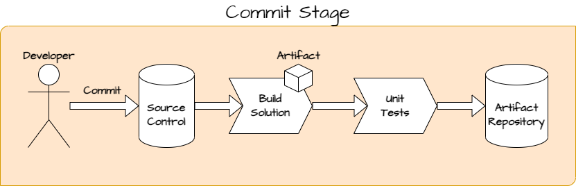
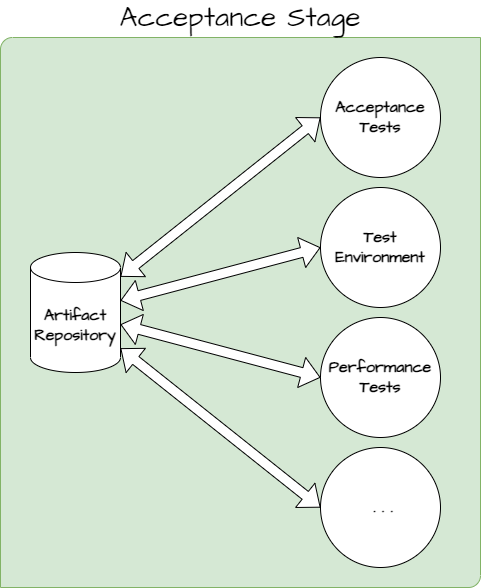

# The Minimal Software Development Process

The mimimal amount of steps to turn ideas into working software are the following

1. Understand the problem
2. Solve the problem
3. Confirm the problem is solved
4. Make the solution available to users
5. Check that the solution keeps working

More commonly, these steps are written in the following format

1. Write requirements
2. Implement the solution
3. Test the solution
4. Deploy the solution into production
5. Monitor availability and performance

If we release code AS IS and don't provide any support for it, only the first two steps are required. But when someone is paying for us to implement and maintain the software, all the five steps are required.

## Working in Small Steps

At the start, no one really knows what the end users want. Even the end user themselves may not know what they want. Therefore, changes are inevitable and we must have an ability to change our minds and our software with ease. To enable this:
- We need to able to easily spot the needs for change
- We need to able to make these changes easily, safely and with confidence

To easily spot the need for this kind of change, **we need to make progress in very small steps**. If the step is too big, then we won't spot the mistake until we have already done a lot of work. Also fixing the mistake at this point will be more laborous.

From the viewpoint of software architecture, our software needs to be modular for us to easily change individual modules without affecting the rest of the system. This can achieved by following good design and coding practices like [SOLID](https://en.wikipedia.org/wiki/SOLID).

From the viewpoint of writing code, we need robust versioning control system, like [git](https://git-scm.com/), which makes it easy to travel back in time in code changes.

## User Stories

User stories specify the outcome that users need, not the solution. We want to express **what the users want** and **not how the solution should look like**. Otherwise the requirements will be too tightly coupled with the solution and any change to the solution also invalidates the requirement. If, along the way, we need radical changes to the solution, we must be able to do so, without the need to modify the original user story.

However, if the original story needs a change, then it is natural that also the solution is updated.

### Acceptance Criteria

User stories must have acceptance criteria that specifies when the story is complete. They are written in a specific, measurable, and testable format, and outline the specific requirements and functionality that the user expects from the system. Acceptance criteria should be well-defined and unambiguous, to ensure that everyone involved in the development process has a clear understanding of what needs to be delivered.

## Continuous Integration

As the solution is formed incrementally, the code is implemented in small batches and synchronized with others continuously. This ensures that when code conflicts happen due to concurrent changes to the same file, we minimize the time to notice it. The most fool-proof way to detect these types of problems is to frequently synchronize the code, ideally multiple times per day.

## Fast Feedback

When publishing code to others, we want fast feedback for the quality of our latest addition. This can be achieved by creating automated code pipeline. The pipeline is triggered each time code is being commited to the versioning control system and it verifies that the software builds and all the unit tests pass. 

This gives us good confidence that the tests executed later will pass too. The later tests should pass at least 80 % of the time when all the unit tests pass. If they fail more often than this, then we lose the confidence of our fast feedback and unit test coverage must be increased to keep up the confidence level.

Because this stage is executed repeatedly, it should ideally take less than 5 minutes.

## Acceptance Stage

When commit stage passes, the acceptance stage is triggered automatically. This stage verifies that the code is deployable into production. The stage can use any means to verify this, for example by

- running acceptance tests
- installing solution to test environment for manual testing
- running other tests and reports (performance tests, security tests, legislative compliance test, etc...)

Ideally, all of the steps here are automated. Verifying too many tests manually hinder our ability to deploy often.

The result of the acceptance stage is treated as the definite answer to the question of deployability. If all the tests pass, the software is, by definition, deployable to production.

## Deployment

Installation to production can happen automatically, or it must be very easily scheduled, or triggered manually.

Even the generation of release notes can be automated, because every deployment has a scope of features that are released. These features are our user stories that can be converted into release notes by automation tools.

## Monitoring

It is crucial that the software deployed is usable at all times, unless otherwise defined. If the software is not available, all the previous efforts put in would be rendered useless. In order to ensure that production problems are promptly addressed, it is important to have a system in place that alerts us when issues arise. This necessitates automated monitoring and, even more importantly, an automated warning system that notifies us when problems occur. This way, we can react quickly to resolve the issues and minimize any potential disruptions to the system.

## References

- [The Most Powerful Software Development Process Is The Easiest](https://www.youtube.com/watch?v=nCuDrWxlh4Y)
- [SOLID](https://en.wikipedia.org/wiki/SOLID)